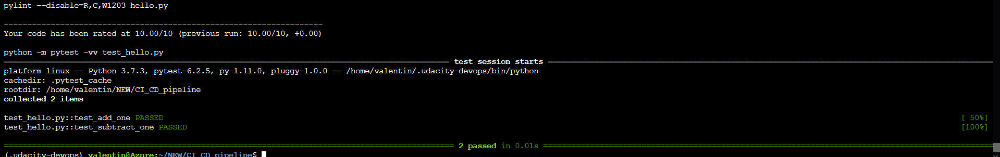

# Overview

IaC bring ease to definition, deployment, incremental upgrades and removing of infrastrucure. VM to infrastracture should be deployed using terrafrom, whilst VM image should be created using packer to be able to easily deploy new instances of same infrastructure. This project will be able to deploy scaleable web application in Azure space using  Azure pipelines and or github actions.

## Project Plan

* A link to a Trello board for the project
    - https://trello.com/b/QfWmwyQQ/build-ci-cd-pipeline
* A link to a spreadsheet that includes the original and final project plan
    - https://docs.google.com/spreadsheets/d/1RchdDTkp0v1HUHbxB5gG_V92NhTrFaPrpbst4_x4Qsg/edit#gid=1348135932

## Instructions

* Architectural Diagram (Shows how key parts of the system work)

1. In Azure, start Azure Cloud shell and get local SSH
2. Add SSH for Azure CS to your github account
2. Fork or copy files from this project to your repository
3. On such scaffolding code, run local tests
4. Clone project to Azure cloud shell
5. Setup Github Actions
7. Prepare Azure DevOps project
8. Connect Github repository and Azure pipeline (yml from this project will allow you that)
9. Make tests and have logs:

* Project running on Azure App Service

* Project cloned into Azure Cloud Shell

* Passing tests

* Failed tests

* Locust tests

* Github Actions test run

* Successful deploy of the project in Azure Pipelines.  [Note the official documentation should be referred to and double checked as you setup CI/CD](https://docs.microsoft.com/en-us/azure/devops/pipelines/ecosystems/python-webapp?view=azure-devops).

* Running Azure App Service from Azure Pipelines automatic deployment

* Successful prediction from deployed flask app in Azure Cloud Shell.

* Output of streamed log files from deployed application

## Enhancements

<TODO: A short description of how to improve the project in the future>

## Demo 

<TODO: Add link Screencast on YouTube>

